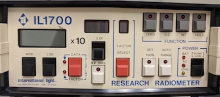
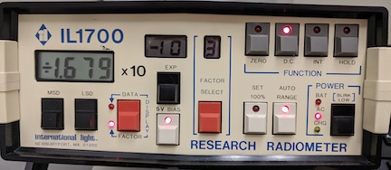
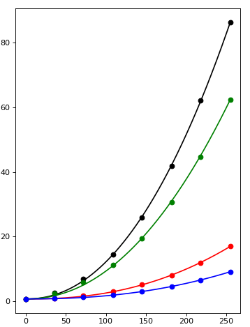

<!-- ## Calibrate Monitor -->

### Prepare Computer

- *Log into Data Collection Computer*
  - Turn on the power of the data collection computer
  - Turn on the CRT monitor in 503B
  - Log-in (use your indiviual PSU login)

### Prepare Photometer

- Take the photometer out of the box. 
- Set it up by plugging in the power and the light meter.
- Turn on the photometer

 

- Ensure the following settings:

### Input the New Factor (Only when photometer sent for Calibration ~every 3 years)

- Select Factor = 1
- Change from Data to Factor
- Ensure Auto is NOT (set 100%)
- Input the new factor on the Optical Calibration Certificate
  - Use the MSD and LSD buttons to enter the Value
  - Select the correct EXP

 

### Zero Photometer

- Place the cap on the light meter
- Press the 'zero' button

### Start Calibrating Luminance

- Start Psychopy - Click icon on Task Bar

- Open Monitor Settings - Go to Tools > Monitor Center

- Click **XXXX**  

    <!-- # -->

- Enter the Monitor Screen Width in centimeters
- Select **Start**  
    <!-- # -->
    

### Calibration Results for Mitsibushi Monitor 01-28-2020

||0|36|72|109|145|182|218|255|
|---|---|---|---|---|---|---|---|---|---|
|lum|0.604|2.58|6.86|14.5|25.8|41.8|62.2|86.4|
|R|0.604|0.852|1.58|2.92|4.99|7.98|11.8|16.9|
|G|0.604|2.20|5.64|11.2|19.3|30.7|44.7|62.4|
|B|0.604|0.738|1.11|1.82|2.89|4.47|6.48|9.04|

Black (0,0,0)[-1,-1,-1] cd/m^2^  
Grey [0,0,0] cd/m^2^
White (255,255,255)[1,1,1] cd/m^2^  

#### Gamma Function of Calibration 01-28-2020

 

<!-- ## Calibrate Projector -->
<!-- ### Run Matlab Script -->

<!-- - At a minimum a black (0,0,0) and white (255,255,255) image must be displayed on the projector screen  -->
<!-- - The script to do this is located on Github: https://gilmore-lab.github.io/photometer_proj -->

<!-- ### Measure Luminance -->

<!-- - Measure the value of each image on the projector screen with the light meter. -->

<!-- ### Log values -->

<!-- - Log the values in the file Box Sync/gilmore-lab/protocols-procedures/projector-calibration.xls -->
