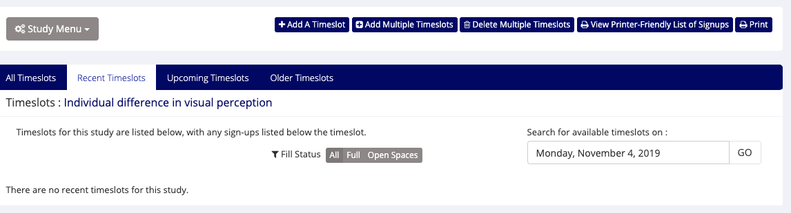

```{r setup, include=FALSE}
knitr::opts_chunk$set(echo = TRUE)
```
# sona system
https://pennstate.sona-systems.com/

# add time slots
- [the schedule](master-protocol.html)
- in the front page, click "view, add or edit timeslots."
- click "Timeslots"
- click "add a Timeslot" or "add multiple timeslots" 
- Set the timeslots
- Add

# cancel the time slots
- delete the participants in this timeslot
"I am so sorry that I need to delete this time slot because no experimenter will be available at that time. We will open more time slots in the following weeks. You are welcome to sign up for these time slots. Your participation is important to us."
- delete the time slots
- confirm "delete"
